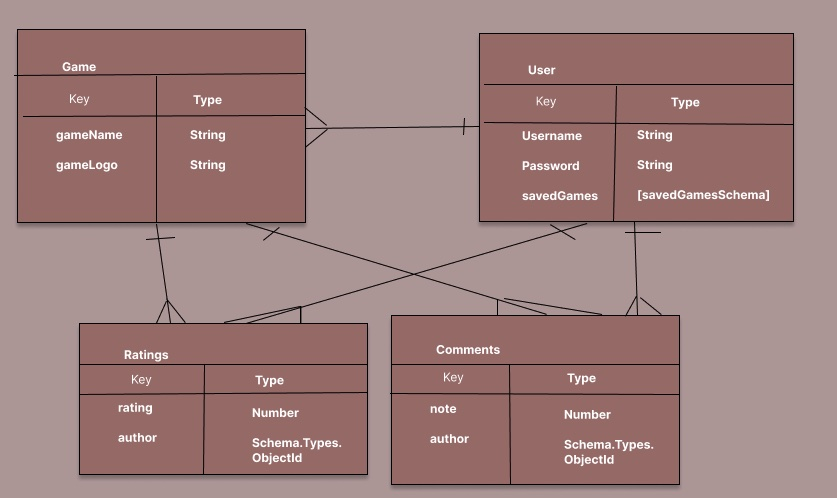

# steamee
## Full-stack Application Project
==link to live site==

## Overview
This is a full-stack Node application designed to help users discover and recommend local co-op games available on Steam. All too frequently, couples, friends, or just any two strangers in a room, scour the internet for good local co-op games, just to find the same three websites, recommending the same handful of games they've already played! It's time to get steamee!

### Technologies Used:
- Mongoose
- MongoDb
- Express
- Morgan
- Postman
- bcryptjs
- Liquid express views
- Axios
- Internal Steam Web API [^5]
    - particularly - GET search/results [^6]
- Do JavaScript, Node, Nodemon, dotenv, method-override, express-session, connect-mongo need to be included?

## User stories
**As a user, I want the ability to** 
- sign up
- sign in
- sign out
- view a list of local co-op games directly from Steam's API
- view the list of local co-op games fellow steamees have saved or added
- sort & the list by the steamee rating
- see how many users have saved the game to their account
- save games to my user account
- indicate if I've played this game as local co-op
- leave a rating out of 5 for the game
- leave a comment on a game
- delete a comment I made
- view comments from other users
- create a new game entry
- Update a game entry I made
- view only my game entries & saved games
- delete only my game entry

## Wireframes/Screenshots


## Entity Relationship Diagrams
 [^7]
**Rough Description of Approach:** 
- On the Steam store screen, an API call will get a filtered list of Steam games to display as cards in the views. 
- Users can "save" the game to their personal profile if they haven't already been saved, or can view the steamee game card, which will contain user ratings entered on steamee, how many users have saved it. If the user wants to dig deeper, they will with view (show route) the game and be able to see user comments. 
- When users save the game, a document will be created from the Game model.
(diagrams that describe the relationships between your resources)
- Eventually, the steamee view-all page will contain other games added by users, in addition to the ones that were saved directly from the steam store API call.

(route tables?)

## Approach taken
- Example API Call: https://store.steampowered.com/search/results/?filter=category3=39&tags=3841&ignore_preferences=1&sort_by=Reviews_DESC&supportedlang=english&json=1
    - shared/split screen (category3=39)
    - local co-op tag (tags=3841)
    - sorted by reviews (sort_by=Reviews_DESC)
    - english games (supportedlang=english)
    - json format (json=1)
    - preferences ignored (ignore_preferences=1)

## Installation instructions
## Unsolved problems

## Project Requirements
Project 2 overview. [^2]
Project planning guide. [^1]
### MVP
**MVP for approval:**
- [ ] Model 1:
    - Game:
        - gameSchema:
            - gameName: String
            - gameLogo: String (will be looking for url)
            - ratings: [ratingSchema]
            - comments: [commentSchema]
            - owner: Schema.Types.ObjectId, ref: 'User'
    - User:
        - userSchema:
            - in addition to below properties, userSchema will contain subdocuments savedGamesSchema
    ```
    const userSchema = new Schema ({
        username: {
            type: String,
            required: true,
            unique: true
        }, 
        password: {
            type: String, 
            required: true
        }
    })
    ```
- [ ] Model or Subdocument 2: 
    - example: ratingSchema
    - additional: commentSchema, savedGamesSchema
        - savedGamesSchema to have {gameId: {type: Schema.Types.ObjectId, ref: 'Game'}}, {hasPlayed: {type: Boolean}}
    ```
    const ratingSchema = new Schema ({
        rating: {
            type: Number, 
            required: true,
            min: 0,
            max: 5
        }, 
        author: {
            type: Schema.Types.ObjectId, 
            ref: 'User', 
            required: true
        }
    }, {
        timestamps: true
    })
    ```
- [ ] API or Seed: Internal Steam Web API, minimum 1 user-created game
- [ ] Resource RESTful routes:
**Stretch Goals:**
- [ ] 
 
**Technical Requirements:**
- [ ] Have at least 2 models, not including user (subdocument permitted)
- [ ] Incorporate API [^4] or seed Database (>=10 documents)
- [ ] Have complete RESTful routes for at least one resource (GET, POST, PUT & DELETE)
- [ ] Utilize ODM (Mongoose) to create database table structure & interact with Mongo-Db-stored data
- [ ] Include a README file that explains how to use app
- [ ] Route table for RESTful routes included in README
- [ ] Semantically clean HTML, CSS, and back-end code
- [ ] Be deployed online & accessibl to public
**Necessary Deliverables:**
- [ ] Project approval (est date of completion 1/23/23)
- [ ] A working full-stack application, built by me, hosted on internet
- [ ] A link to hosted working app in URL section of Github repo
- [ ] A git repo hosted on Github with link to hosted project, frequent commits, dating back to the very beginning of the project
- [ ] A README.md with explanations of technologies used, approach taken, installation insutrctions, unsolved problems, and a link to the live site

### Project Planning
**Sprint 1 (Est completion 1/23/23):**
- [ ] Develop project pitch (1/20/23-1/23/23)
- [ ] Create README.md file with project plannings steps
- [ ] Gain project approval (1/23/23)

**Sprint 2 (Est completion 1/23/23):**
- [ ] Review mongoose-express-liquid-boilerplate documentation [^3]
- [ ] Follow boilerplate installation instructions [^3]
- [ ] Install other dependencies as needed
- [ ] Ensure API functioning properly from template
- [ ] Begin model 1 build 
- [ ] Seed database and/or incoporate API
- [ ] Create Index & Show Routes & test in Postman

**Sprint 3 (Est completion 1/25/23):**
- [ ] Adjust seed route to script if necessary
- [ ] Create user model
- [ ] Complete model 1 5 RESTful routes & test in Postman ( - new & edit to be completed)
- [ ] Create model 2/subdocument
- [ ] Create user & model 2 routes, and test in Postman
- [ ] Confirm back-end development working without unnecessary bugs
- [ ] Set up for liquid-views

**Sprint 4 (Est completion 1/27/23):**
- [ ] Complete liquid views
- [ ] Enhance styling of pages, get feedback
- [ ] Update responses & error handling for liquid views
- [ ] Conduct extensive views testing & ensure DB connection intact
- [ ] Evaluate readiness for deployment
- [ ] Merge development branch(s) as needed with main

**Sprint 5 (Est completion 1/29/23):**
- [ ] Deploy application
- [ ] Conduct extensive testing
- [ ] Conduct user acceptance testing
- [ ] Address bugs, errors, feedback
- [ ] Update README.md with all necessary requirements & information
- [ ] Confirm all technical requirements & MVP completion
- [ ] Submit project 2 per submission instructions

**Final Deliverable (Est completion 1/30/23):**
- [ ] Present deliverable to SEI Cohort & Instructors
- [ ] Update documentation to incorporate feedback and development opportunities

[^1]: https://git.generalassemb.ly/sei-ec-remote/planning-projects
[^2]: https://git.generalassemb.ly/sei-ec-remote/project_2
[^3]: https://git.generalassemb.ly/sei-ec-remote/mongoose-express-liquid-boilerplate
[^4]: https://github.com/public-apis/public-apis#business
[^5]: https://github.com/Revadike/InternalSteamWebAPI/wiki
[^6]: https://github.com/Revadike/InternalSteamWebAPI/wiki/Get-Search-Results
[^7]: used figma to create ERD
