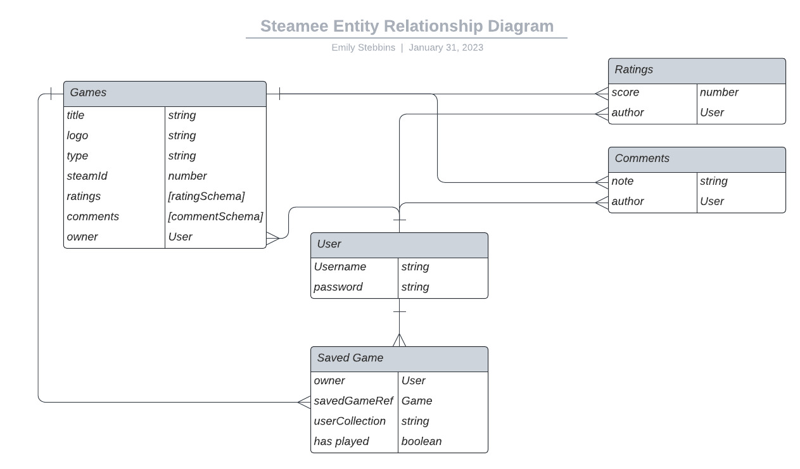

# steamee
## Full-stack Application Project
==link to live site==

## Overview
This is a full-stack Node application designed to help users discover and suggest local co-op games available on Steam. All too frequently, couples, friends, or just any two strangers in a room, scour the internet for good local co-op games, just to find the same three websites, recommending the same handful of games they've already played! It's time to get steamee!

### Technologies Used:
- Mongoose
- MongoDb
- Express
- Morgan
- Postman
- bcryptjs
- Liquid express views
- Axios
- Internal Steam Web API [^5]
    - particularly - GET search/results [^6]
- JavaScript
- packages: Node, Nodemon, dotenv, method-override, express-session, connect-mongo

## User stories
**As a user, I want the ability to** 
- sign up
- sign in
- sign out
- view a list of local co-op games directly from Steam's API
- view the list of local co-op games fellow steamees have suggested
- save games to my user account
- indicate if I've played this game as local co-op
- leave a rating out of 5 for the game
- leave a comment on a game
- delete a comment I made
- view comments from other users
- create a new game entry
- Update a saved game entry I made
- view only my game entries & saved games
- delete only my saved game entry
### Development
- sort & the list by the steamee rating
- see how many users have saved the game to their account
- search & filter steamee games
- see more features of games such as genre
- see more results from Steam
- generate error when adding a game that is not local co-op
- share my user collections publicly or with specific users
- see more store pages/platforms/media - such as boardgames, https://api-docs.igdb.com/#getting-started, PlayStation, Xbox, etc.
- select from existing custom collection name

## Wireframes/Screenshots


## Entity Relationship Diagrams
 [^7]   

#### Games 
| **URL**              | **HTTP Verb** |**Actions**|
|----------------------|---------------|-----------|
| /games/store          | GET           | index
| /games/:storeId/new   | GET           | new (with Steam info)
| /games/newForm/      | GET           | new
| /games/    | POST           | new (send to savedGames)
| /games/newForm/getInfo   | POST       | create     | 
| /games/:id          | GET           | show         |

#### Administrative game routes - users will not be permitted to edit/delete suggested games
| **URL**              | **HTTP Verb** |**Actions**|
|----------------------|---------------|-----------|
| /games/             | GET           | index
| /games/mine         | GET           | index
| /games/:id/edit     | GET           | edit
| /games/:id          | PATCH/PUT     | update
| /games/:id          | DELETE        | destroy   |

#### Saved Games
| **URL**              | **HTTP Verb** |**Actions**|
|----------------------|---------------|-----------|
| /savedGames/mine         | GET           | index
| /savedGames/:id          | GET           | show
| /savedGames/new          | GET           | new
| /savedGames/new          | POST          | create
| /savedGames/:id/edit     | GET           | edit
| /savedGames/:id          | PATCH/PUT     | update
| /savedGames/:id          | DELETE        | destroy   |

#### ratings

| **URL**              | **HTTP Verb** |**Actions**|
|----------------------------------------|---------------|-----------|
| /ratings/:gameId                     | POST          | create
| /ratings/:gameId          |PUT            | update
| /ratings/delete/:gameID/:ratingId   | DELETE        | destroy   |

#### comments

| **URL**              | **HTTP Verb** |**Actions**|
|----------------------------------------|---------------|-----------|
| /comments/:gameId                     | POST          | create
| /comments/delete/:gameID/:commentId   | DELETE        | destroy   |

#### Authentication: Users

| **URL**              | **HTTP Verb** |**Actions**|**Controller#Action**|
|----------------------|---------------|-----------|---------------------|
| /auth/signup         | POST          | new       | users#signup
| /auth/login          | POST          | create    | users#login
| /auth/logout         | DELETE        | destroy   | users#logout        |

## Approach taken
**Rough Draft Description of Approach:** 
- On the Steam store screen, an API call will get a filtered list of Steam games to display as cards in the views. 
- Users can "save" the game to their personal profile if they haven't already been saved, or can view the steamee game card, which will contain user ratings entered on steamee. If the user wants to dig deeper, they will with view (show route) the game and be able to see user comments. 
- When users suggest a new game, a document will be created from the Game model.
- Eventually, the steamee view-all page will contain other games added by users, in addition to the ones that were saved directly from the steam store API call.
- Example API Call: https://store.steampowered.com/search/results/?filter=category3=39&tags=3841&ignore_preferences=1&sort_by=Reviews_DESC&supportedlang=english&json=1
    - shared/split screen (category3=39)
    - local co-op tag (tags=3841)
    - sorted by reviews (sort_by=Reviews_DESC)
    - english games (supportedlang=english)
    - json format (json=1)
    - preferences ignored (ignore_preferences=1)
RESULTS:
```
"desc": "",
    "items": [
        {
            "name": "Rhythm of the Night",
            "logo": "https://cdn.cloudflare.steamstatic.com/steam/bundles/23200/6lbanfr9qo1lpmt7/capsule_sm_120.jpg?t=1634705480"
        },
        {
            "name": "Rhythm Doctor",
            "logo": "https://cdn.cloudflare.steamstatic.com/steam/apps/774181/capsule_sm_120.jpg?t=1667332753"
        },
        {
            "name": "Left 4 Dead Bundle",
            "logo": "https://cdn.cloudflare.steamstatic.com/steam/bundles/233/38smshw5fjvh9vp4/capsule_sm_120.jpg?t=1456861419"
        },
```
- STRETCH GOAL (completed): Users can enter their own games, and if they include a steam id (found in the url of the game's store page after app/NNNNNNN, an API call using the GET /broadcast/ajaxgetbatchappcapsuleinfo will link in other information about the game. Example store page url: https://store.steampowered.com/app/312530/Duck_Game/
- Example API Call: https://store.steampowered.com/broadcast/ajaxgetbatchappcapsuleinfo?appids=312530&cc=NL&l=english&origin=https:%2F%2Fstore.steampowered.com
RESULTS:
```
{
    "apps": [
        {
            "appid": 312530,
            "type": "game",
            "title": "Duck Game",
            "capsule": "312530/header.jpg?t=1606522299",
            "main_capsule": "312530/capsule_616x353.jpg?t=1606522299",
            "tiny_capsule": "312530/capsule_sm_120.jpg?t=1606522299",
            "subid": 47116,
            "orig_price_in_cents": 1299,
            "orig_price": "",
            "price_in_cents": 1299,
            "price": "12,99€",
            "is_free": false,
            "free_weekend_label": "",
            "library_asset": "312530/library_600x900.jpg?t=1606522299",
            "discount_percent": 0,
            "rt_release_date": 1433437184,
            "release": "4 Jun, 2015",
            "reviews_filtered": {
                "num_reviews": 22305,
                "num_positive": 21661,
                "score": 9,
                "label": "Overwhelmingly Positive"
            },
            "reviews_unfiltered": {
                "num_reviews": 22305,
                "num_positive": 21661,
                "score": 9,
                "label": "Overwhelmingly Positive"
            },
            "content_descriptors": [],
            "available_windows": true,
            "available_mac": false,
            "available_linux": false,
            "screenshot_list": [
                "312530/ss_e0d4c29f0c6b93903916d35ec79ea5f2560932d5.jpg?t=1606522299",
                "312530/ss_6da6723e0908f866142d69cebb5c13ec60063cab.jpg?t=1606522299",
                "312530/ss_b20f323e1d27e4573a2afae3f4db9021da89dd3c.jpg?t=1606522299",
                "312530/ss_250bcab1b9bbb209bf90ef4fe3a3178e4a33e184.jpg?t=1606522299"
            ],
            "microtrailer": "https://cdn.akamai.steamstatic.com/steam/apps/2039860/microtrailer.webm?t=1447375811",
            "microtrailer_mp4": "https://cdn.akamai.steamstatic.com/steam/apps/2039860/microtrailer.mp4?t=1447375811",
            "button_action": "Add to Cart",
            "tags": [
                {
                    "name": "Multiplayer",
                    "tagid": 3859
                },
                {
                    "name": "Funny",
                    "tagid": 4136
                },
                {
                    "name": "Pixel Graphics",
                    "tagid": 3964
                },
                {
                    "name": "Local Multiplayer",
                    "tagid": 7368
                },
                {
                    "name": "Action",
                    "tagid": 19
                },
                {
                    "name": "2D",
                    "tagid": 3871
                },
                {
                    "name": "4 Player Local",
                    "tagid": 4840
                },
                {
                    "name": "Platformer",
                    "tagid": 1625
                },
                {
                    "name": "Indie",
                    "tagid": 492
                },
                {
                    "name": "Fast-Paced",
                    "tagid": 1734
                }
            ],
            "app_to_run": 312530,
            "coming_soon": false,
            "early_access": false,
            "no_main_cap": false,
            "required_age": 0,
            "support_vrhmd": false,
            "support_vrhmd_only": false,
            "creator_clan_ids": [
                5635894
            ],
            "localized_langs": [
                0
            ],
            "deck_compatibility_category": 3
        }
    ],
    "success": 1
}
```

## Installation instructions
**Using the application**
- When utilizing steamee, the intention is to interact with games that users have suggested through this application, not with the Steam store page, other than to find other games to suggest without having to go to Steam's store pages.
- Browse games other users have suggested under the "get steamee" section.
- Save games to your profile in custom collections that others have suggested by hitting the add heart icon from the get steamee page
- Edit the collection that your game belongs to easily by hitting the edit heart button from your saved games, or delete by hitting the trash can
- Suggest games in the "give steamee" section by browsing the Steam store API call results or by creating a new suggestion
- Leave comments and/or ratings on a game when you view the game from the "get steamee" section or when viewing from your profile of saved games

## Unsolved problems
- Multiple of the same Steam game could be added. Had to remove the unique: true of the steamId property in game model as multiple games with no steam ID were able to be added.
- Deleting games from the game collection does not remove the game from saved games
- Editing/deleting games from the game collection - this is meant to be an administrative task, shortterm work arounds are present
- The Steam store API call is limited, therefore multiple API calls would make the store page more robust/dynamic
- Author not populating on saved games show page for comments

## Project Requirements
Project 2 overview. [^2]
Project planning guide. [^1]
### MVP
**MVP for approval:**
- [x] Model 1:
    - Game:
```javascript
const gameSchema = new Schema({
		title: { 
            type: String, 
            required: true 
        },
		logo: { 
            type: String, 
        },
        type: {
            type: String,
            required: true,
            default: 'video game'
        },
        steamId: {
            type: Number,
        },
        ratings: [ratingSchema],
        comments: [commentSchema],
		owner: {
			type: Schema.Types.ObjectID,
			ref: 'User',
		}
	}, { 
        timestamps: true, 
        toObject: { virtuals: true },
        toJSON: { virtuals: true }
})
```
    - User:
        - userSchema:
            - in addition to below properties, userSchema will contain subdocuments savedGamesSchema
    ```
    const userSchema = new Schema ({
        username: {
            type: String,
            required: true,
            unique: true
        }, 
        password: {
            type: String, 
            required: true
        }
    })
    ```
- [x] Model or Subdocument 2: 
    - example: ratingSchema
    ```javascript
        const ratingSchema = new Schema ({
        rating: {
            type: Number, 
            required: true,
            min: 0,
            max: 5
        }, 
        author: {
            type: Schema.Types.ObjectId, 
            ref: 'User', 
            required: true
        }
    }, {
        timestamps: true
    })
    ```
    - additional: commentSchema, savedGamesSchema (became model during development process)
    ```javascript
    const commentSchema = new Schema ({
    note: {
        type: String, 
        required: true,
    }, 
    author: {
        type: Schema.Types.ObjectId, 
        ref: 'User', 
        required: true
    }
    }, {
    timestamps: true
    })
    ```
        - savedGamesSchema:
    ```javascript
    const savedGameSchema = new Schema ({
    owner: {
        type: Schema.Types.ObjectId, 
        ref: 'User', 
        required: true
    },
    savedGameRef: {
        type: Schema.Types.ObjectId,
        ref: 'Game',
        required: true
    },
    userCollection: {
        type: String, 
        default: 'My Saved Games',
        required: true
    },
    hasPlayed: {
        type: Boolean,
        required: true,
    },
    }, {
    timestamps: true
    })
    ```

   

- [x] API or Seed: Internal Steam Web API, minimum 1 user-created game
- [x] Resource RESTful routes: SavedGames

**Stretch Goals:**
- [x] Users can add new games to the db
 
**Technical Requirements:**
- [x] Have at least 2 models, not including user (subdocument permitted)
- [x] Incorporate API [^4] or seed Database (>=10 documents)
- [x] Have complete RESTful routes for at least one resource (GET, POST, PUT & DELETE)
- [x] Utilize ODM (Mongoose) to create database table structure & interact with Mongo-Db-stored data
- [x] Include a README file that explains how to use app
- [x] Route table for RESTful routes included in README
- [x] Semantically clean HTML, CSS, and back-end code
- [ ] Be deployed online & accessibl to public
**Necessary Deliverables:**
- [x] Project approval (est date of completion 1/23/23)
- [ ] A working full-stack application, built by me, hosted on internet
- [ ] A link to hosted working app in URL section of Github repo
- [ ] A git repo hosted on Github with link to hosted project, frequent commits, dating back to the very beginning of the project
- [ ] A README.md with explanations of technologies used, approach taken, installation insutrctions, unsolved problems, and a link to the live site

### Project Planning
**Sprint 1 (Est completion 1/23/23):**
- [x] Develop project pitch (1/20/23-1/23/23)
- [x] Create README.md file with project plannings steps
- [x] Gain project approval (1/23/23)

**Sprint 2 (Est completion 1/23/23):**
- [x] Review mongoose-express-liquid-boilerplate documentation [^3]
- [x] Follow boilerplate installation instructions [^3]
- [x] Install other dependencies as needed
- [x] Ensure API functioning properly from template
- [x] Begin model 1 build 
- [x] Seed database and/or incoporate API
- [x] Create Index & Show Routes & test in Postman

**Sprint 3 (Est completion 1/25/23):**
- [ ] Adjust seed route to script if necessary (N/A)
- [x] Create user model (in boilerplate)
- [x] Complete model 1 5 RESTful routes & test in Postman 
- [x] Create model 2/subdocument
- [x] Create user & model 2 routes, and test in Postman
- [x] Confirm back-end development working without unnecessary bugs
- [x] Set up for liquid-views

**Sprint 4 (Est completion 1/27/23):**
- [x] Complete liquid views
- [x] Enhance styling of pages, get feedback
- [x] Update responses & error handling for liquid views
- [x] Conduct extensive views testing & ensure DB connection intact
- [x] Evaluate readiness for deployment
- [ ] Merge development branch(s) as needed with main

**Sprint 5 (Est completion Delayed 2/02/23):**
- [ ] Deploy application
- [ ] Conduct extensive testing
- [ ] Conduct user acceptance testing
- [ ] Address bugs, errors, feedback
- [x] Update README.md with all necessary requirements & information
- [x] Confirm all technical requirements & MVP completion
- [x] Submit project 2 per submission instructions

**Final Deliverable (Est completion 1/30/23):**
- [x] Present deliverable to SEI Cohort & Instructors
- [x] Update documentation to incorporate feedback and development opportunities

**Image & Icon sources**
- Three Heart-shaped Red Stones Placed on Tic-tac-toe Game Bord: Photo by Pixabay from Pexels: https://www.pexels.com/photo/board-chalk-chalkboard-color-220057/ 
- Game Cards - Pixel Heart with color <a href="https://www.flaticon.com/free-icons/pixel" title="pixel icons">Pixel icons created by apien - Flaticon</a>
- Game Cards:hover - Pixel Heart black <a href="https://www.flaticon.com/free-icons/heart" title="heart icons">Heart icons created by apien - Flaticon</a>
- Icon - edit Heart - <a href="https://www.flaticon.com/free-icons/ui" title="ui icons">Ui icons created by Graphics Plazza - Flaticon</a>
- Icon - edit heart: hover (heart paper and pencil) - <a href="https://www.flaticon.com/free-icons/love-and-romance" title="love and romance icons">Love and romance icons created by kmg design - Flaticon</a>
- Icon - trash can closed <a href="https://www.flaticon.com/free-icons/trash" title="trash icons">Trash icons created by Freepik - Flaticon</a>
- Icon - trash can with hearts <a href="https://www.flaticon.com/free-icons/love-and-romance" title="love and romance icons">Love and romance icons created by juicy_fish - Flaticon</a>
- Icon - Not Played - Broken Heart <a href="https://www.flaticon.com/free-icons/break-up" title="break-up icons">Break-up icons created by Freepik - Flaticon</a>
- Icon - played - two hearts <a href="https://www.flaticon.com/free-icons/heart" title="heart icons">Heart icons created by itim2101 - Flaticon</a>
- Icon - Add Heart <a href="https://www.flaticon.com/free-icons/plus-sign" title="plus sign icons">Plus sign icons created by Pixel perfect - Flaticon</a>
- Icon - saved game: hover <a href="https://www.flaticon.com/free-icons/favorite" title="favorite icons">Favorite icons created by Mia on Jazz the Cat - Flaticon</a>
- Icon - saved game <a href="https://www.flaticon.com/free-icons/wishlist" title="wishlist icons">Wishlist icons created by Mia on Jazz the Cat - Flaticon</a>
- Icon - suggest game - <a href="https://www.flaticon.com/free-icons/quality" title="quality icons">Quality icons created by Freepik - Flaticon</a>
- Icon - add comment/rating/create game - <a href="https://www.flaticon.com/free-icons/plus" title="plus icons">Plus icons created by Vectors Market - Flaticon</a>
- Icon - number of comments <a href="https://www.flaticon.com/free-icons/chat-box" title="chat box icons">Chat box icons created by Graphics Plazza - Flaticon</a>
- Error page - heart break https://pixabay.com/photos/love-heart-broken-sad-unhappy-cry-1281655/


[^1]: https://git.generalassemb.ly/sei-ec-remote/planning-projects
[^2]: https://git.generalassemb.ly/sei-ec-remote/project_2
[^3]: https://git.generalassemb.ly/sei-ec-remote/mongoose-express-liquid-boilerplate
[^4]: https://github.com/public-apis/public-apis#business
[^5]: https://github.com/Revadike/InternalSteamWebAPI/wiki
[^6]: https://github.com/Revadike/InternalSteamWebAPI/wiki/Get-Search-Results
[^7]: used Lucid Chart to develop the final ERD. Figma for original (in assets folder)

Color pallette guide: https://icolorpalette.com/download/palette/446754_color_palette.jpg 

